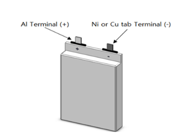
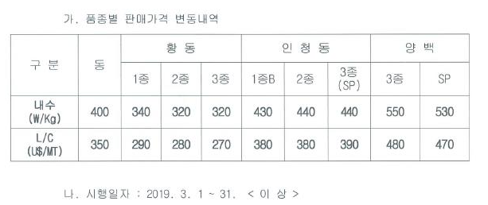
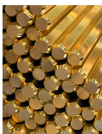
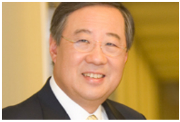

# 기업분석 - 풍산홀딩스 , 005810.KS 

배당수익률 4.5%, 시가총액 3126억, PE 4.6,, PB 0.39, 매출 2.8조, ROE 6%,

### 세줄요약

- ​구리값이 상승추세라 실적개선이 일어날 수 있다.
- 구리 최대 수요처인 중국의 경기가 안좋을 경우 구리값이 다시 떨어질 수 있다.
- 가격이 낮을 때 분할 매수 하는 편이 좋을 것 같다.

### 이건 알고가자

풍산홀딩스 (이하 "동사") 는 지주회사로, 자회사로 풍산특수금속, 풍산메탈서비스, 풍산화동양행, 디에이케이코리아를 가지고 있다. 

인데, 풍산은 비철금속/방위산업, 풍산특수금속은 스테인리스 및 특수금속을 생산하는데, 두 회사가 거의 대부분의 자산을 가지고 있다. 따라서 상장된 풍산도 같이 이야기해야 한다. 풍산 특수금속은 연 순익 80억정도 나는 회사이고, 장부가로는 573억정도로 들어있어서 비상장이긴 하지만 크게 문제는 없다. 나머지 회사들은 의미 없다고 본다. 

풍산특수금속은 기념주화생산, 초극박스프링재 등을 생산하는 회사로 국내에서는 과점적 위치를 차지하고 있다. 풍산이 구리에 치중한다면 풍산특수금속은 정밀 스테인리스 소재에 치중한다. 스프링, 가스켓, 전자기기 외장 , 기계부품등에 사용된다. 2차전지용 고순도 니켈,구리,알루미늄 등의 터미널류도 제조하는데, 아래와 같이 생겼다

나름 알짜기업이라 상장도 안하고 있는 것 같은데, 나중에 상장할 수는 있겠지만 언제가 될 지는 알 수 없다. 그리고 기념주화도 만든다. 풍산특수금속은 매년 매출이 약 20% 정도 증가하고 있어서, 밸류에이션을 잘 주면 동사 시총의 50%를 차지할 수도 있는 회사기는 하다.  동사가 95% 지분을 가지고있고, POSCO 가 5%를 가지고 있다. 

#### 풍산

풍산은 경기민감업종으로, 구리가격에 민감하게 반응한다. 주요제품은 동합금등의 구리관련 사업과 탄약만드는 방산사업을 영위하고 있는데, 구리가격은 전체적으로 상승중이다. 역시 중국이 가장 큰 수요처라, 중국경기와 특히 관련이 높은데, 최근 미중간 무역분쟁이 어찌됐든간에 (잘되든 못되든) 해결될 조짐이 보이고, 협상의 대가 트럼프도 딜을 빠그라뜨리지는 않는 역사를 볼 때, 마무리가 안될 가능성은 없어보인다. 무역전쟁과 경기둔화 우려는 2018년내내 어느정도 조정이 된 상태라 가격적인 부담은 2018년보다는 적다고 보인다. 구리얘기였다. 

구리가 원체 경기민감에 기초 생산소재이다보니, GDP 성장률에 민감하게 반응하는데, 중국 GDP 가 사실 6~6.5% 로 이전보다는 상대적으로 낮은 성장률을 보이지만, 저건 실질성장률이고, 인플레이션을 감안한 명목성장률은 9% 정도에 근접해 있다. 따라서 원자재 가격은 인플레이션을 고려해야 하므로 2016년 저점 대비 현재 구리가격은 여전히 가격이 오른 상태가 아니다. 추가적인 하락이 심화될 가능성이 그렇게 크지 않다고 보인다.

방산의 경우에는 전체적으로 진보정권하에서 "자주국방" 을 주로 외치기 때문에, 방위비는 보수정권보다는 늘어나는 것이 일반적이다. 김대중정부 때 줄긴 했지만, 그 때는 IMF 때라 무슨 예산을 늘릴 여지가 없었다고 본다. 방위비는 평균보다 더 늘어날 가능성이 있다. 동사의 사업비중은 구리관련이 70%, 방산부문이 30%정도 된다. 따라서 구리값이 중요하지 방산은 그다지 중요하지 않다고 생각할 수 있으나 방산쪽 영업이익률이 훨씬 높다. 

동사의 구리관련 제품은 동으로 만든 판, 대, 봉, 선, 소전 등인데 동판이야 다 알거고.  판/대 의 경우가 동사의 주력인데 시장점유율은 약 51~52% 수준이고 일정하다. 과점상태라고 보이며, 실제로 동사는 월별로 제품의 가격을 환율 및 원재료값에 의해 구매자에게 쉽게 전가하는 편이다. 

위는 2월 제품 단가 가격변동표인데 2월까지는 가격이 내려가다가, 3월에는 

상승세로 반전했다.  미중협상등에 따라 달라지겠지만, 일단 구리값은 단기 저점은 통과한 것으로 생각된다. 물론 미래는 알 수 없지만. 

아래는 주요제품 가격변동 추이인데, 2016년 구리값이 저점일때 대비해서 20~30% 상승해있다. 2019년은 어찌될지 모르지만 현 상태보다 내려가기는 힘들 것으로 보인다. 

 동봉은 아래같이 생겼는데, 볼트 너트등에 사용된다. 

주요 수출품중에 하나가 소전 (동전의 소재) 인데, 40개국정도에 수출하고 있다. 어차피 동 관련 점유율이 커서 동으로 만드는것중에 반정도는 풍산에서 나온다고 보면 된다. 그런데 신용카드를 많이 쓰면서, 실물화폐들이 점점 사라지고 있으니 동전주(?) 가 향후실적이 좋을 것 같지는 않다. 다만 소전분야는 동사 사업중 비중이 크게 높은 것은 아니다.  아래서 언급할 가족 시민권용 미국현지법인인 PMX 인더스트리도 미국에 소전을 공급하려고 만든회사다.

원재료가격추이는 아래와 같은데, 비슷한 수준으로 올랐다. 

### 임원진 및 주요주주

창업자는 류찬우 회장으로, 현 회장 류진씨는 큰형 대신 가업을 물려받았다. 류찬우회장은 1999년 사망했다. 장남 류청씨는 박근혜전대통령(?) 동생 박근령씨와 결혼했다가 6개월만에 이혼하고 LA 에서 살고 있다. 류진회장의 부인인 헬렌 노 (한국명 노혜경) 씨는 5공때 국무총리인 노신영씨 딸이다. 뭐 그렇고 그런거지. 헬렌노 씨는 미국시민권자인데, 영주권이랑 시민권을 풍산 미국 자회사인 PMX 인더스트리에 근무하면서 취득했고, 류진회장의 아들 류성곤 (로이스 류) 씨도 미국시민권을 취득했는데, 병역기피 의혹이 있다. 이게 2014년정도. 뭐 여전히 주주들이긴 하다 주주명부에서 이름만 바뀌었지. http://sundayjournalusa.com/2018/05/24/%EB%8B%A8%EB%8F%85-%ED%92%8D%EC%82%B0%EA%B8%88%EC%86%8D-%EB%A5%98%EC%A7%84%ED%9A%8C%EC%9E%A5-%EC%9D%BC%EA%B0%80-%EB%B2%A0%EB%B2%84%EB%A6%AC%ED%9E%90%EC%8A%A4-%EB%8C%80%EC%A0%80%ED%83%9D-%EC%8B%AC/

회장님은 저렇게 생겼다.  서울대 영문과 졸업후 다트머스에서 MBA 를 했다. 이 류씨집안은 조선시대 류성룡의 후손인데, '징비록' 을 지었다. 그래서 회장님이 KBS 드라마 징비록에 후원하라고 지시하셨단다. 가문의 영광. 뭐 류성룡의 유지를 이어받아 방산업을 한다고는 하는데, 글쎄 좀 비약이 심하다. 참고로 류성룡이 없었으면, 이순신도 천거를 못받고 우리나라는 지금 대일본제국이 되어있을 것 같다. 전생에 나라를 구한 것이 아니라, 조상이 나라를 구해서 재벌이 되셨나보다.

나름 5공인사계열이고, 마당발이고 해서 여기저기서 자리를 많이 하고 있긴 한데, 가족관련 의혹이나 뭐 겸사겸사해서 도덕성이 뛰어난지는 모르겠다. 미국통이고 부시일가와 친분이 있는 것으로 보인다. 

미국에서 정치인 로비관련 의혹이 있는데, 사실 미국은 로비가 불법은 아니다. 그리고 방산업이나 소전사업을 하려면 당연히 정계에 연이 닿아있어야 한다. 정치자금 헌금이라고 해봐야 몇억정도 했던 것으로 나타났다. 까려면 깔 수 있지만 국내로비도 아니고 뇌물도 아닌데 지나치게 뭐라 할 것은 없다고 본다. 미국기업들은 해외에서 뇌물주는 행위를 자국법상에서 처벌을 안한다. 대부분의 나라들이 그모냥이다. 그렇다고 뇌물을 주라는 건 아니고. 

### 재무사항 및리스크

매출은 약간 정체상태인데, 구리값이 2015년대비 낮아져있어서 그런 편이고 환율이 2018년부터 상승해 있어서 2019년도부터는 원화환산 매출이 증가할 가능성은 있다. 하지만 국제경기가 불안해서 구리값이나 유가처럼 경기초민감 상품 가격들은 크게 상승할 가능성은 높지 않다. 다만 2018년도에 일정부분 선 반영된 부분이 있어서 급락가능성도 높지 않다.

판관비등의 비용관리는 잘 되는 편이고, 원재료 가격의 전가도 과점적인 사업구조상 어렵지 않다. 대박은 나기 힘들지만 쪽박도 잘 안나며, 4차산업이든 5차산업이든간에 구리는 필요하게 되므로 큰 사업적인 리스크는 없다. 소전사업이야 어차피 없어질 것 같고. 

재무적으로는 튼튼한 회사다. 현금흐름을 보면 아래와 같은데,

2014년, 2015년, 2016년에 각각 부채를 갚고 있다. 최근부터 현금흐름이 좋아지고 있다. 

### 잡담

대형회사이고 경기민감주다보니 리서치리포트가 많이 나오는 편이다. 그래서 딱히 볼 것은 없고, 가격이 낮아졌을 때 천천히 사모으는 전략이 좋을 것 같다. 크게 망할 회사는 아니다. 

그럼 풍산을 살것이냐 풍산홀딩스를 살 것이냐. 풍산특수금속의 밸류에이션이나 지주회사 할인에 의한 시가배당률로 볼 때 풍산홀딩스가 더 유리해 보인다. 풍산 자체는 구리값에 영향을 너무 받고 변동성이 상당히 큰 회사인 반면 풍산홀딩스는 어느정도 분산이 되어있기 때문이다. 물론 상속관련 이슈가 생기면 풍산홀딩스 주가가 벅벅 길 수도 있다. 툭하면 옥상옥 만드는 기형적인 가업상속문화때문에. 

### 면책

본 문서는 개인적인 판단과 분석을 수행한 문서로, 매수매도 등의 투자의견과는 전혀 상관없음을 알려드린다. 투자결정은 각 개별 투자자가 해야하며, 그에 따른 이익이나 손실 또한 각 투자자에게 귀속된다. 또한 본 문서의 내용중 사실과 다른점이 있을 경우에는 알려주길 바라며, 이는 객관적 사실에 한한다. 미래 계획이나 전망등이 다르다고 해서 요청되는 수정사항은 무시됨을 알려드린다. 

### 

