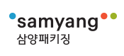
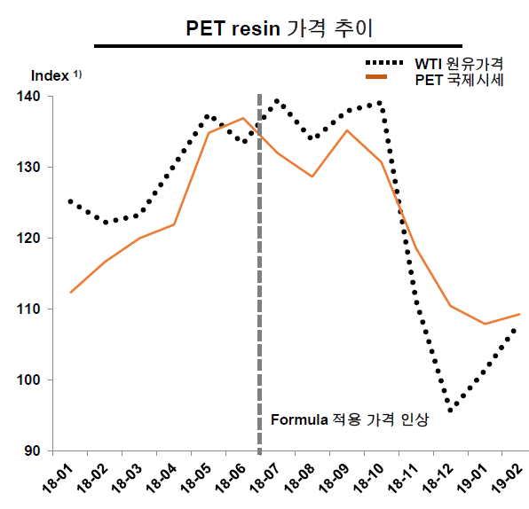
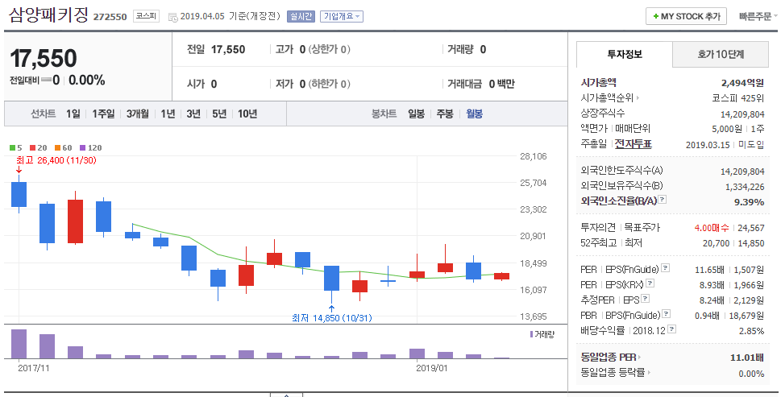
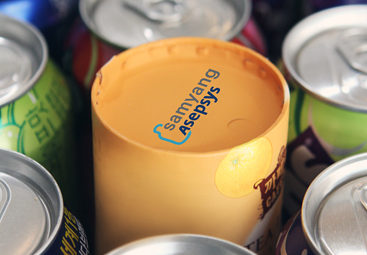
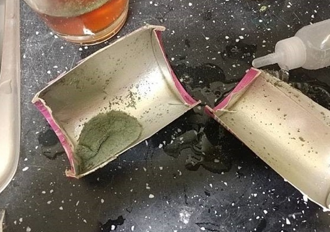
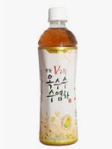

# 기업분석 - 삼양패키징, 272550.KS

### 세줄요약

- 성장률이 적당한 중성장형(연 6~12%) 안정적 기업으로 생각된다.
- 현금흐름이 매우 좋고, 과점적인 상황에서 1위중이라 기업가치가 갑자기 흔들릴 가능성은 적다
- 2018년부터 해외시장 공략중인 것 같다. ODM 방식으로 아셉틱방식으로 제조된 음료를 해외 (인도네시아 등) 에 갖다팔고 있는데, 잘 될지는 모르겠다.

### 이건 알고가자

삼양패키징은 페트병이나 음료수 캔 만드는 회사인데, 일반적인 PET 병 (PET 는 재료이다) 과 무균공정으로 만들어지는 아셉틱 용기등을 만드는 국내 1위업체이다. 원료값의 이전은 쉬운 편으로, 비용증가에 따른 실적변화는 적은 편이다. 음료산업 성장과 밀접하기 때문에 음료시장 성장률에 따라 직접 영향을 받게 된다.

가격전가는 공식에 기반해 이전하는데, 그래도 원료값 (유가, PET) 의 지나친 변동/상승에는 어느정도 취약성을 가진다.  그래서 2018년도에 좀 아래와 같이 심한 조정을 겪었는데, 영업이익이 약간 감소한 수준이다 (10% 정도 감소). 2019년 들어서 원재료 값은 하향안정화 되었다고 보인다. (아래 참조). 하지만 최근에 다시 유가가 상승세로 비용이 상승할 가능성은 존재한다. 

PET 아셉틱 음료시장 성장률은 연평균 3~7% 로 추정되며, 음료시장은 앞으로도 6%이상 성장할 것으로 보인다. 즉 동사의 매출도 연평균 5% 이상은 증가할 것이며, 신규투자로 생산능력이 2019년 3월에 추가공장이 완성되면 24% 정도, 2020년후 9% 증가로, 총 33% 정도 성장분은 어느정도 준비되었다고 본다.  특히 아셉틱음료 OEM/ODM 의 경우에는 전체 시장이 13%정도 매년 성장하는 추세라 동사의 성장 가능성은 대략 연 9~10% 정도는 무난할 것으로 보인다. 

카토캔 (위 사진) 이라는 걸 2018년 여름에 생산하기 시작했는데, 종이랑 알루미늄이랑 겹겹이 붙여서 만든 캔이라고 보면 된다. 카토캔은 독일 회라우프사가 글로벌 특허를 가지고 있어서, 국내에서는 동사만이 만들어팔 수 있다.  친환경소재이기도 하고 무게도 가볍고 해서 부가가치가 높은 편인데, 독일기술을 가져와서 만든 것이다. 그런데 2019년 1월에 맨날 사고만 치고 다니는 남양의 우유회사 카토캔 제품에서 곰팡이가 발견되어 물의를 빚은 적이 있다. 하지만 저 카토캔 자체는 제조시 이산화탄소 발생량도 적고, 여러가지로 친환경 소재이고 해서 사용량은 점차 늘어나는 추세이다. 또한 은근 대규모 장치산업인 특성, 그리고 다양한 금형은 단시일 내에 만들어낼 수 있는 것이 아니라서, 보기에는 플라스틱 회사인것 같아도 나름 입지가 탄탄한 편이다. 국내에서는 그냥 1등이고. 

위 사진이 문제가 된 남양유업 카토캔인데, 남양유업측은 배송중에 구멍이 나서 곰팡이가 생겼다고 책임회피를 하고 있지만, 글쎄올시다. 원체 사고를 많이 쳐놔서 믿음이 안간다. 여튼 1월에 저런 문제가 있음에도 딱히 주가에는 큰 영향이 없었고, 동사는 배송중에도 문제 없도록 캔을 강화하겠다고 하고 일단락 되었다.

아셉틱이라는 것은 완전 무균화 음료제조방법이라고 보면 되는데, 기존에 PET 병은 고온 열처리로 멸균작업을 하게 된다. 반면에 아셉틱 시스템으로 제조된 페트병에 완전 살균된 음료를 담는 설비인데 사실 이 기술은 효성 아셉시스라는 회사를 동사가 인수 (2015년) 하면서 얻게 된 것이다. 이 아셉틱 시스템은 몇년전까지는 한국과 일본 외에는 가지고 있는 나라가 없으니 국내에서도 아셉틱 시스템은 동사가 압도적이라고 보면 된다. 은근 대규모 장치산업이라서 진입장벽이 상당히 높다고 본다.  

외관상 달라보이지는 않지만 저런 제품에 아셉틱 시스템을 적용한다. 특히 유제품등에 유리한데, 변질되기 쉬운 유제품등을 아셉틱 시스템으로 충전하게 되면 좀 더 안전하게 유통,보관할 수 있게 된다나. 

계절성으로는 대략 음료성수기인 5~11월에서 1~2개월 앞서게 된다 (음료수만들기전에 병 주문해야지) 그래서 2,3분기가 매출이 높다. 또한 각 음료회사별로 모양이 제품 용기의 모양이 달라 금형을 처음 뜬 곳에서 지속적으로 공급 받는것이 가격적으로나 심적으로나 편하기 때문에, 한번 고객이 된 경우에는 쉽게 다른 공급자를 찾기가 쉽지 않다. 게다가 Formula 방식의 가격전가 시스템은, 마진 조금 씌워서 그대로 납품하겠다는 것이라, 신규 생산자의 시장진입이 극도로 어려워진다. 

최근 연구개발 목록인데, 지속적으로 뭔가를 만들어내고 있다. 연구개발비는 대략 연 20억수준이다. 

### 임원진 및 주요주주

최대주주는 삼양사 (삼양사는 삼양홀딩스가 지배한다) 이고, 52.8% 정도 가지고 있다. SC PE (Standard Chartered Private Equity) 가 49% 가지고 있었는데 (상장 전) , 현재는 약 9.16% 정도 보유하고 있다. Exit 을 고가에 잘 한 것으로 보인다. (원래 IPO 때 주식사는 건 일반적으로 바보짓이다). 삼양사, 마리나삼양, 우리사주조합이 도합 63% 정도 가지고 있어서 경영권은 안정적이고, 소액주주가 25.6% 인 것으로 보이는데 나머지 11% 정도는 누가 가지고 있을까. 1%~5% 사이의 주주가 약 11%를 가지고 있으므로, 최대 11명, 최소 3명정도로 추산된다 (이런 쓸데없는 계산)

삼양사는 알다시피 삼양식품이랑은 전혀 다른 기업이다. 인촌 김성수 (동아일보 사장. 손기정 일장기 지운걸로 짤림, 현재의 경방인 경성방직도 세움) 동생인 김연수가 영농법을 만들어 (정확히는 농토관리법) 전파하려고 삼수사 라는 회사를 차린 것이 삼양사의 시작이다.  김성수는 독립운동도 하고 뭐 고생도 많이 했고, 김연수도 고생도 많이하고 경성방직 사장으로도 재직했는데, 일제 말기에 친일의혹이 있어 반민특위에 끌려간 적이 있기는 하다. 다만 이후에 반성문을 쓸 정도의 양심은 있었던 것 같다. 

여튼 삼양사는 김연수의 3남,5남 김상홍/김상하의 아들들이 경영중이다.  동사는 5남 김상하의 아들들인 김원, 김정씨 중 김정씨가 부회장으로 있다. 김정씨는 삼양홀딩스 사장하다가 2018년 3월에 삼양패키징 부회장으로 승진(?) 했다. 삼양홀딩스 회장은 김상홍씨의 아들인 김윤 회장이다. 이거 뭐 발렌베리가문이 롤 모델인가. 정신머리가 없네.

 

암튼 김정 부회장 (1960년생) 은 위와같이 생겼다.  (연봉은 7억 8천만원정도다. 영업익 350~420억 나는 회사인데 8억가까이 받는게 많은건지 적은건지) 동사의 2018년 급여총액은 74억정도 된다.  이중 10%를 대표이사도 아닌 부회장님이 꿀꺽. 이건 좀 책임경영과 동떨어진 것 아닌가.  동사의 대표이사는  이경섭대표이사로 (1965년생), 인촌 김성수가문 (인촌이 고려대를 만들었다) 에 걸맞게 고려대 출신이다. 영업통이라 영업능력에는 문제가 없을 것으로 상상은 된다. 대표이사도 주식을 한 1억원어치 들고 있다. (1억 됐다 말았다 한다). 이사/감사 전체 보수는 16억원정도인데, 2018년 3월에 들어오신 부회장님이 7억8천이니 연봉은 10억인가보다. 여튼 이사감사가 5명인데 이중에 1명이 7.8억이니 4명이 8억원 나눠먹으면 1인당 2억원 수준이다. 그다지 높지는 않지만 부회장님 좀 양보좀 하시지. 배당도 드실거면서. (하지만 부회장님은 동사의 지분은 없다.)

직원들 평균 근속년수가 16.7년인데, 평균 연봉도 7500만원이다. 규모와 다르게 나름 직원들한테 잘 해주는 모양이다. 사업보고서도 뭐 다른데 비하면 성의있게 쓴 편이다. 물의를 일으키거나 하는 집안은 아니고, 창업주들 형제들이 친일파로 매도되어도 그냥 꾹꾹 참는 편인 것 같다. 공과를 따지자면 김성수/김연수 형제는 공이 더 많고 과가 있긴 한데 그것도 다른 친일파들에 비하면 조족지혈로 보인다. 꼴통막장이 되어버린 사돈기업 (김성수 막내여동생이 결혼한 김용완 가문) 경방보다는 훨씬 나아 보인다.

### 재무사항 및리스크

매출은 연 10~15% 정도씩 꾸준하게 증가하고 있으며, 이는 음료시장 성장과 궤를 같이 한다. 영업익은 2018년에 약 15% 정도 감소했는데, 매출원가가 좀 많이 증가해서 그렇다. 매출이익률은 일반적인 시기에는 22% 정도인데, 2018년에는 원재료비의 급격한 변동성으로 매출이익률이 19.5% 로 감소했기 때문이다. 하지만 현금흐름은 매우 좋다. 2018년에는 영업익 감소로 감소했으나, 영업현금흐름이 2018년에도 420억이고, 207년까지는 500억대이다. 2018년 비용문제가 해결되어 가므로 2019년도부터는 500억 이상의 현금흐름이 꾸준히 들어올 것이라 생각이 된다. 

부채비율은 105% 정도인데, 크게 문제가 되는 것은 아니고, 차입만 고려한 차입비율은 75%정도 수준이다. 그 외 일반적인 재무비율도 깔끔하다. PE 가 몇년 갖고 있어서 여러가지로 깔끔을 떤 흔적들이 남아있다. 

약간 까리한 것은, PET 원재료 (PET Chip) 을 2018년에 삼양사로부터 776억원어치, 2017년엔 298억원어치 구매했는데, 이게 늘어나야 할 이유가 있나? 내부거래로 영업이익 갉아먹고 있는 것은 아닌지 의심스럽다. 확인할 필요가 있다. 까마귀 날자 배떨어진다고, 매출원가가 늘었는데 재료를 대주주 회사에서 사왔다라... 삼양사도 PET 병을 만든다 일년에 한 20억개정도. 이걸 동사가 가져와서 팔기도 하는 모양인데 뭐 규모가 크진 않다. 

### 잡담

뭐 그냥 나빠보이지 않는다. 식품관련 기업이라 불경기에 방어도 어느정도 되고, 변동성도 커보이지 않는다. 수출이 가능해지면 나름 고성장도 가능할 것 같기는 한데, 이건 사실 잘 모르겠다. 일단 내수에서는 안전성이 입증이 되어있고, 영업능력도 괜찮은 편이다. 할랄인증까지 받아서 인도네시아 시장에도 진출해 있는데, 어떻게 될지는 잘. 

### 면책

본 문서는 개인적인 판단과 분석을 수행한 문서로, 매수매도 등의 투자의견과는 전혀 상관없음을 알려드린다. 투자결정은 각 개별 투자자가 해야하며, 그에 따른 이익이나 손실 또한 각 투자자에게 귀속된다. 또한 본 문서의 내용중 사실과 다른점이 있을 경우에는 알려주길 바라며, 이는 객관적 사실에 한한다. 

### 

